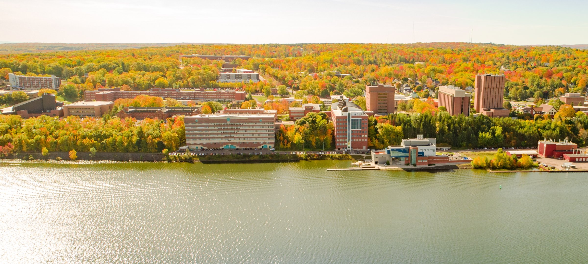

# Join Our Research Group

## PhD Positions in AI for Software Engineering

- **Start Term:** Fall 2026
- **Location:** Department of Computer Science, Michigan Technological University
- **Advisor:** Prof. Jie Wu, Department of Computer Science
- **Advisor Website:** [https://jie-jw-wu.github.io/](https://jie-jw-wu.github.io/)

## Description

Prof. Jie Wu is inviting applications for **fully funded PhD positions** starting in Fall 2026, in a quest to perform research on approaches that advance AI-assisted software engineering. Our research lies at the intersection of **Software Engineering and AI**, with a strong emphasis on building **trustworthy AIware** (AI-powered software). We are passionate about the opportunities to shape foundational approaches that ensure trustworthiness, reliability, safety, and human-centered design in next-generation AIware.

### Research Areas of Interest (not limited to):

- **AI for Software Engineering**
- **Large Language Models and Agentic Flow for Code**
- **Software Engineering for AI** (a.k.a. AI Engineering / Machine Learning in Production)
- **AI4Code in Engineering, Science, and Education**

## Desired Expectations

### Core Qualities We Look For:

- **Task Orientation:** A great aptitude toward finishing given tasks and meeting project milestones
- **Highly Motivated:** Passion for research and strong interest in pursuing a PhD in the field
- **Grit Mindset:** Perseverance and determination in achieving the PhD degree

### Preferred Candidates Will Have:

- Demonstrated strengths such as strong research skills with prior research experience (e.g., publications), or excellent programming skills (e.g., programming contests or software projects)
- Proficiency in training and inferencing Large Language Models (LLMs)
- Practical experiences as a software engineer or contributor to open-source software
- Opportunity to be hourly RA to work with Prof. Jie Wu before the official PhD start date

## Application Instructions

Interested applicants should send their application materials via email to **[jie.jw.wu@mtu.edu](mailto:jie.jw.wu@mtu.edu)** with the subject line format:

**Prospective PhD Student – [Your Full Name] – [Intended Start Term]**

*(Please use this exact title format to help ensure your email isn't filtered.)*

## About Michigan Tech

Michigan Technological University (Michigan Tech) is a newly elevated **R1 research university** with a long-standing strength in engineering disciplines and robust, stable research funding. The Computer Science Department provides a highly supportive environment with a low student-to-faculty ratio and a strong culture of collaboration.

Michigan Tech is located in Houghton, in Michigan's scenic Upper Peninsula, near the Great Lakes. The community is known for being welcoming and inclusive. The region is safe, peaceful, and offers beautiful natural surroundings — an ideal environment for focused research.

  

[← Back to Homepage](index.md)
