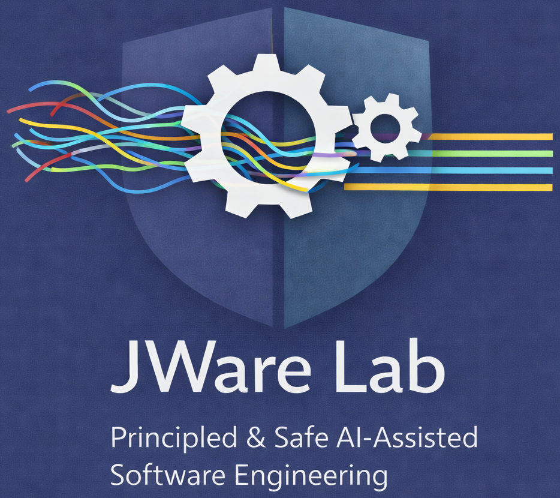
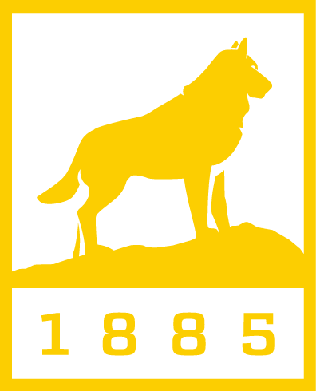

  
  

  

JWare Lab (杰件实验室) is affiliated with the [Department of Computer Science](https://www.cs.mtu.edu) at Michigan Technological University. The name *JWare* is inspired by the PI's first name, *Jie* (pronounced "jyeh"), a character meaning greatness. This reflects our aspiration: that software, built with the right foundations, can be truly great. We also aspire to empower students with the foundations to build great software in their future careers — in an era increasingly shaped by Generative AI.

We investigate the quality foundations, principles, and methodologies that make AI-assisted software engineering rigorous and trustworthy. Our research spans the full software development lifecycle: design, coding, testing, review, deployment, and maintenance. We are committed to ensuring that AI tools elevate the quality and safety of software, rather than erode it.

---

## Lab Members

### Faculty

  

    

    

      <strong><a href="index.html">Dr. Jie Wu</a></strong>
      Principal Investigator
    

  

### PhD Students

  

    

    

      <strong>Joshana Shakya</strong>
      PhD Student (incoming Fall 2026)
    

  

  

    

    

      <strong>Indrajeet Roy</strong>
      PhD Student (incoming Fall 2026)
    

  

  

    

    

      <strong><a href="https://jdafoe.com/" target="_blank">Josh Dafoe</a></strong>
      PhD Student (co-advised by <a href="https://www.mtu.edu/cs/department/people/faculty/chen/" target="_blank">Prof. Bo Chen</a>)
    

  

### Undergraduate Students

  

    

    

      <strong>Gabe Dautovi</strong>
      Undergraduate Student
    

  

  

    

    

      <strong>Andrew Sadler</strong>
      Undergraduate Student
    

  

---

## News

- **Jun 2026** — Indrajeet Roy and Joshana Shakya join as incoming PhD students (Fall 2026)
- **Jun 2026** — JWare Lab website was launched
- **Jun 2026** — Research positions open for undergrad and graduate students — Summer & Fall 2026

---

## Join Us

 **🎓 Hiring PhD Position (Fall 2026):** I am recruiting highly-motivated students to join my research group at Michigan Tech, a Carnegie R1 (Very High Research Activity) institution, to work at the intersection of Software Engineering and AI, particularly Large Language Models. See more details in this [link](join-us.html). I apologize that I'm unable to reply to each email individually. A practical tip: the strongest applicants apply directly to the PhD program rather than waiting for my reply, and we talk once they stand out in the applicant pool. 

 **📧 Hiring RA Position at MTU (Summer / Fall 2026):** Paid Undergraduate/Graduate Research Opportunity available in Agentic Software Engineering for MTU students. If you are interested, please see this [link](join-us.html). 

See our [open positions](join-us.html) for full details on both.

---



[← Back to Homepage](index.html)
