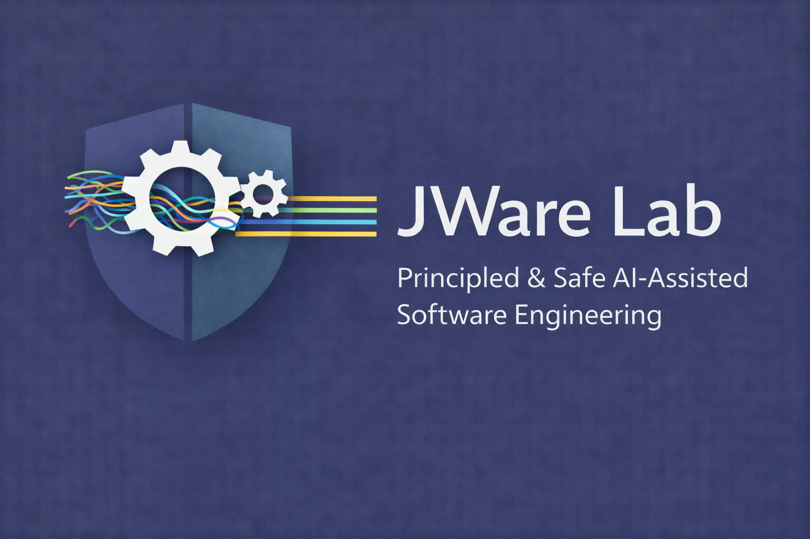

  

# JWare Lab · 杰件实验室

**Principled & Safe AI-Assisted Software Engineering**

The name *Jie* (杰) means **greatness** — so **JWare** means **Great Software**. This reflects our core belief: we want to empower every student in the JWare Lab to build great software throughout their future career.

JWare Lab investigates quality foundations and principles in AI-assisted software engineering — spanning the **full software development lifecycle** (design, coding, testing, review, deployment, and maintenance). We focus on quality and safety in the new era of AI-generated code, ensuring that AI tools enhance rather than erode engineering rigor at every stage of development.

---

## Lab Members

### PhD Students

- **Indrajeet Roy** *(incoming Fall 2026)*
- **Joshana Shakya** *(incoming Fall 2026)*

### Undergraduate Students

- **Gabe Dautovi**
- **Andrew Sadler**

---

## Join Us

We are actively recruiting **undergraduate and graduate students** at Michigan Technological University (MTU) to conduct research on principled AI-assisted software engineering across the full software development lifecycle.

If you are a motivated student interested in software engineering, AI, or LLMs and want to contribute to meaningful, safety-focused research, we'd love to hear from you.

Please reach out to **[jie.jw.wu@mtu.edu](mailto:jie.jw.wu@mtu.edu)** with the subject line:

**Prospective Lab Member – [Your Full Name] – [Degree Level]**

---

[← Back to Homepage](index.html)
